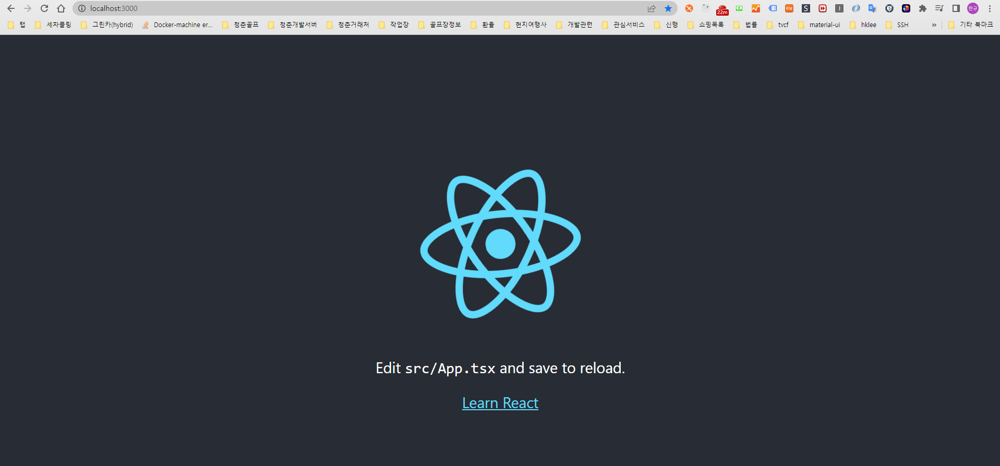
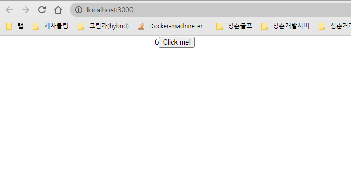

# 개발환경
```text
node - v16.10.0
npm - v7.24.0
yarn - v1.22.18
```

# 1. lerna 설치 및 초기설정
root 디렉토리를 만들고 package를 workspaces가 관리하도록 설정합니다.
```bash
& mkdir lerna-cra && cd lerna-cra && npx lerna init
lerna notice cli v4.0.0
lerna info Initializing Git repository
lerna info Creating package.json
lerna info Creating lerna.json        
lerna info Creating packages directory
lerna success Initialized Lerna files
```
```json
# root/lerna.json
{
  "packages": [
    "packages/*"
  ],
  "version": "independent",
  "npmClient": "yarn",
  "useWorkspaces": true
}
# root/package.json
{
  "name": "@leehankue/root",
  "private": true,
  "devDependencies": {
    "lerna": "^4.0.0"
  },
  "workspaces": {
    "packages": ["packages/**"]
  }
}
```

# 2. packages에 CRA로 components와 app 프로젝트 생성하기
```bash
$ cd packages
$ yarn create react-app components --template typescript
$ yarn create react-app app --template typescript
```

# 3. craco 설치하기
craco는 devDependencies 환경에서만 사용할 것이기 때문에 --dev 옵션을 주고,
-W가 workspaces에서 사용할 수 있도록 해줍니다.
```bash
$ yarn add --dev craco -W
```
# 4. packages의 각 package.json name 수정하기
```json
// root/packages/app/package.josn
{
  "name": "@leehankue/app",
  (...)
  "dependencies": {
    (...)
    "@leehankue/components": "^0.1.0"
  },
}
// root/packages/components/package.josn
{
  "name": "@leehankue/components",
  "main": "./src/index.tsx",
  (...)
}
// root/package.json
{
 (...)
  "scripts": {
    "start": "lerna exec --scope @leehankue/app -- yarn start"
  },
 (...)
}
```
[참고] 의존성 주입은 lerna cli로 입력 가능하다.
```bash
# Injecting dependency components into app
lerna add @leehankue/components --scope=@leehankue/app
```
이제 터미널 root 경로에서 yarn start를 하면 app의 package.json 문서의 scripts를 참조하여 yarn start가 실행됩니다.


# 5. components package 에서 Button 컴포넌트 만들기
```typescript
// root/packages/components/src/components/Button.tsx
import React from 'react'
interface Props extends React.DOMAttributes<HTMLButtonElement> {
    children?:React.ReactNode;
}
const Button: React.FC<Props> = ({...props}) => {
  return (
    <button {...props}>{props.children}</button>
  )
}
export default Button
```
```typescript
// root/packages/components/src/index.tsx
import Button from './components/Button';
export { Button };
```
```json
// root/packages/components/package.json
{
  (...)
  "main": "./src/index.tsx",
  (...)
}
```

# 6. app package 에서 Button 컴포넌트 사용하기
```typescript
// root/packages/app/src/App.tsx
import React from 'react';
import { Button } from '@leehankue/components';
import './App.css';
function App() {
  const [state, setState] = React.useState(0);
  return (
    <div className="App">
     {state}
     <Button onClick={()=>setState(s=>s+1)}>Click me!</Button>
    </div>
  );
}
export default App;
```

# 응용프로그램 끌어올리기 그리고 오류메세지.
```bash
$ yarn lerna bootstrap
$ yarn start
# 오류 메세지
Compiled with problems:X
ERROR in ../components/src/components/Button.tsx 5:0
Module parse failed: The keyword 'interface' is reserved (5:0)
File was processed with these loaders:
 * ../../node_modules/@pmmmwh/react-refresh-webpack-plugin/loader/index.js
 * ../../node_modules/source-map-loader/dist/cjs.js
You may need an additional loader to handle the result of these loaders.
| import React from 'react'
| 
> interface Props extends React.DOMAttributes<HTMLButtonElement> {
|     children?:React.ReactNode;
| }
```
CRA에는 이미 로더가 설정되어 있는 webpack 구성이 있으며, 이를 재정의(override) 해야합니다.
.jsx 및 typescript으로 작성되었으므로 사용하기 전에 트랜스파일해야 하므로
이 애플리케이션에서 Loader를 사용하기를 원합니다.
```bash
$ cd packages/app && touch craco.config.js
```
웹팩 재정의 하기
```javascript
// root/packages/app/craco.config.js
const path = require('path');
const { getLoader, loaderByName } = require('@craco/craco');
const packages = [];
packages.push(path.join(__dirname, "../components"));
module.exports = {
    webpack: {
        configure: (webpackConfig) => {
            const { isFound, match } = getLoader(webpackConfig,loaderByName('babel-loader'));
            if(isFound) {
                const include = Array.isArray(match.loader.include)
                    ? match.loader.include
                    : [match.loader.include];
                match.loader.include = include.concat(packages);
                return webpackConfig;
            }
        }
    }
}
```
app > package.json > scripts 수정하기
```json
{
    (...)
  "scripts": {
    "start": "craco start",
    "build": "craco build",
    "test": "craco test",
    "eject": "craco eject"
  },
    (...)
}
```
# 결과
